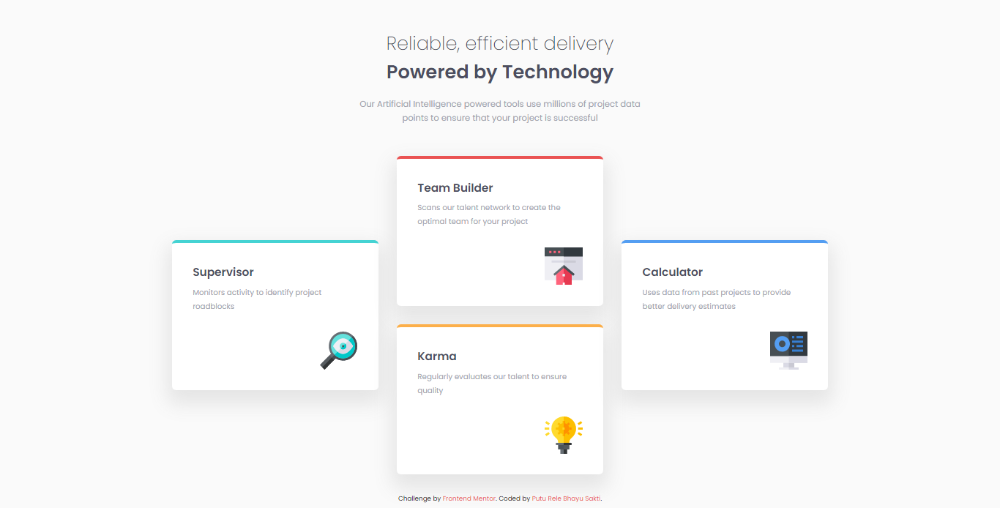
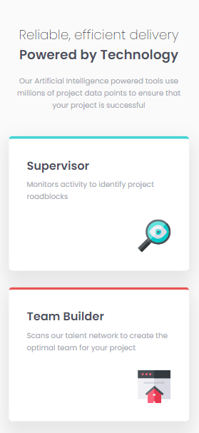
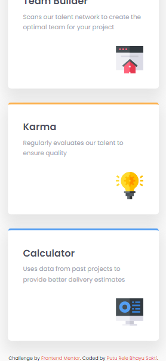

# Frontend Mentor - Four card feature section solution

This is a solution to the [Four card feature section challenge on Frontend Mentor](https://www.frontendmentor.io/challenges/four-card-feature-section-weK1eFYK). Frontend Mentor challenges help you improve your coding skills by building realistic projects.

## Table of contents

- [Overview](#overview)
  - [The challenge](#the-challenge)
  - [Screenshot](#screenshot)
  - [Links](#links)
- [My process](#my-process)
  - [Built with](#built-with)
  - [What I learned](#what-i-learned)
  - [Continued development](#continued-development)
  - [Useful resources](#useful-resources)
- [Author](#author)

## Overview

### The challenge

Users should be able to:

- View the optimal layout for the site depending on their device's screen size

### Screenshot

### Links

- Solution URL: [Solution URL here](https://www.frontendmentor.io/solutions/four-card-feature-section-using-css-grid-and-flexbox-vGExR_tjlq)
- Live Site URL: [Live site URL here](https://lere22.github.io/four-card-feature-section/)

## My process

### Built with

- Semantic HTML5 markup
- CSS custom properties
- Flexbox
- CSS Grid

### What I learned

What I learned from creating the project Four card feature section is how to use grid to manipulated the card with the same position as the design guide.

### Continued development

I want to continue this project to collaborate with my other projects in the future.

### Useful resources

- [Fonts](https://fonts.google.com/) - This helped me for choosing the font what i want.
- [Frontend Mentor Resource](https://www.frontendmentor.io/resources) - This is an amazing resource which helped me to working on frontend project.
- [MDN Web Docs](https://developer.mozilla.org/en-US/docs/Web/CSS) - This documentation help me to find the detail about syntax that I used on my project.
- [CSS Tricks](https://css-tricks.com/) - This is a website which gave me some tips to code CSS especially.
- [W3 Schools](https://www.w3schools.com/) - This helped me for understanding the syntax of some programming language.
- [nekoCalc](https://www.w3schools.com/) - This helped me to convert pixels(PX) to REM.

## Author

- Code by - Putu Rele Bhayu Sakti
- Frontend Mentor - [@lere22](https://www.frontendmentor.io/profile/lere22)
